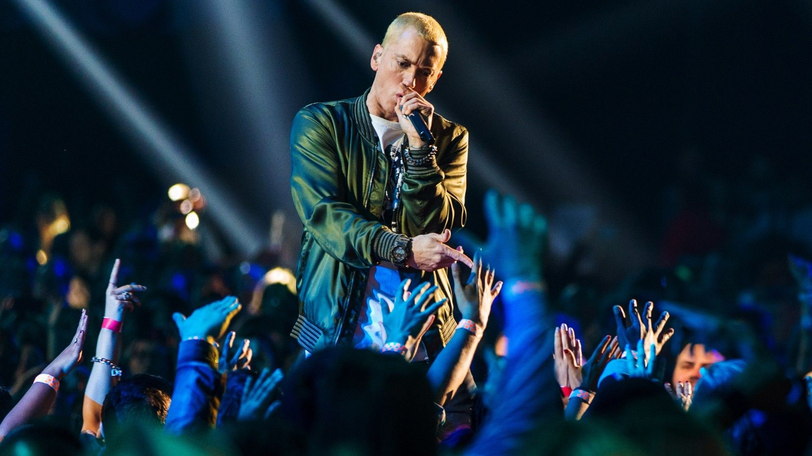

\newline
\newline
\newline
 
\newline
\newline

Eminem is the most successful artist of the 21st century. Currently he holds the number 1 and number 4 spots for most the albums sold this century; The Marshall Mathers LP has sold 32 million copies and The Eminem Show was sold 30 million copies.

\newline

Hip-hop as a musical genre has become mainstream the past few decades, and boasts a wide variety of talented artists and respective subgenres. Eminem has made himself a household name in the Hip-hop community with his lyrical prowess and musical talent. The following analysis serves to compare Eminem's music with that of Hip-hop in the 21st century to determine how he differs from this generations hip-hop artists and what makes him a unique talent.

\newline

All the data analyses were conducted with a corpus 110,000+ song lyrics from Metrolyrics. Specifically, I am utilizing data filtered for the 21st century in the genre of Hip-hop.

\newline
\newline

```{r load libraries, echo=FALSE, warning=FALSE, message=FALSE}

packages.used=c("tidyverse","tidytext","plotly","DT","tm", "dplyr",
                "data.table", "scales", "wordcloud2", 
                "gridExtra", "ngram", "shiny",
                "tidyr", "ggplot2", "cowplot","magrittr")

# check packages that need to be installed.
packages.needed=setdiff(packages.used, 
                        intersect(installed.packages()[,1], 
                                  packages.used))
# install additional packages
if(length(packages.needed)>0){
  install.packages(packages.needed, dependencies = TRUE)
}


library(tidyverse)
library(tidytext)
library(plotly)
library(DT)
library(tm)
library(data.table)
library(scales)
library(wordcloud2)
library(gridExtra)
library(ngram)
library(shiny) 
library(dplyr)
library(tidyr)
library(ggplot2)
library(cowplot)
library(magrittr)
library(plotly)

# load lyrics data
load('../output/processed_lyrics.RData') 
# load artist information
dt_artist <- fread('../data/artists.csv') 


lyrics_list <- c("Folk", "R&B", "Electronic", "Jazz", "Indie", "Country", "Rock", "Metal", "Pop", "Hip-Hop", "Other")
time_list <- c("1970s", "1980s", "1990s", "2000s", "2010s")
corpus <- VCorpus(VectorSource(dt_lyrics$stemmedwords))

```
\newline

## Eminem vs. Hip-Hop: A Sentiment Analysis 

\newline

The first thing we can analyze, following the preprocessing of our dataset, is to perform a sentiment analysis in order to help understand the emotion and opinion in Eminem's music as well as in 21st Hip-hop as a whole. To help analyze the lyrics, I utilized the tidytext package along with [UIC's "bing" lexicon and dataset](https://www.cs.uic.edu/~liub/FBS/sentiment-analysis.html). 

The bing lexicon is a binary classification dataset based on unigram representations (single words); using this lexicon, we can assign words into positive or negative classes. 

\newline
\newline 
```{r, echo=FALSE, warning=FALSE, message=FALSE, fig.align='center'}


library(tidytext)
library(tidyr)
library(ggplot2)
library(cowplot)


tidy_eminem <- filter(dt_lyrics, artist == 'eminem') %>%
  unnest_tokens(word, lyrics)

bing <- get_sentiments("bing")
tidy_eminem <- cbind(tidy_eminem, "ind"= 1:dim(tidy_eminem)[1])

eminiem_sentiment <- tidy_eminem %>%
  inner_join(bing) %>%
  count(artist, index = ind%/% 800, sentiment) %>%
  spread(sentiment, n, fill = 0) %>%
  mutate(sentiment = positive - negative)

em_sentimentplot <- ggplot(eminiem_sentiment, aes(index, sentiment, fill = artist)) +
  geom_bar(stat = "identity", show.legend = FALSE) +
  facet_wrap(~artist, ncol = 2, scales = "free_x")+ ylim(-100, 100)

###########

tidy_hiphop <- filter(dt_lyrics, genre == 'Hip-Hop', year > 1999) %>%
  unnest_tokens(word, lyrics)

bing <- get_sentiments("bing")
tidy_hiphop <- cbind(tidy_hiphop, "ind"= 1:dim(tidy_hiphop)[1])

hiphop_sentiment <- tidy_hiphop %>%
  inner_join(bing) %>%
  count(genre, index = ind%/% 500, sentiment) %>%
  spread(sentiment, n, fill = 0) %>%
  mutate(sentiment = positive - negative)

hiphop_sentimentplot <- ggplot(hiphop_sentiment, aes(index, sentiment, fill = genre)) +
  geom_bar(stat = "identity", show.legend = FALSE) +
  facet_wrap(~genre, ncol = 2, scales = "free_x") + ylim(-100, 100)

plot_grid(em_sentimentplot, hiphop_sentimentplot)


```
\newline

These plots represent a trajectory of sentiment scores from 2000 - 2015. The x-axis is the index of the song number, and each point on the graph represents a individual song's sentiment score. The most obvious trend can be seen in how Eminem's discography primarily is outputting negative sentiments, while hip-hop songs, on average, have no distinct sentimental trend. 

\newline
In the dataset, we have filtered ~500 eminem songs (including remixes/freestyles) and ~8000 hip-hop songs. (It is also important to note that the corpus obtained in Metrolyrics is a far from perfect source of data.)

\newline

Next, I decided to analyze the songs with the most common positive or negative words and that most effect the sentiment analysis. 

\newline

```{r, echo=FALSE, warning=FALSE, message=FALSE, fig.align='center'}

em_song_counts <- tidy_eminem %>%
  inner_join(bing) %>%
  count(song, sentiment, sort = TRUE)

em_song_counts %>%
  filter(n >80) %>%
  mutate(n = ifelse(sentiment == "negative", -n, n)) %>%
  mutate(song = reorder(song, n)) %>%
  ggplot(aes(song, n, fill = sentiment)) +
  geom_col() +
  coord_flip() +
  labs(y = "Contribution to sentiment")


```
\newline

As inferred from the previous graph, the songs that are most emotionally driven are entirely negative, with the exception of two songs in the corpus, which happen to be interviews tranposed into lyrics that accidentally made its way into the dataset. 

The next graph I created served to help understand and find other hip-hop artists that have the most emotionally driven and sentimental discography.

\newline
```{r, echo=FALSE, warning=FALSE, message=FALSE, fig.align='center'}
############################################

hiphop_song_counts <- tidy_hiphop %>%
  inner_join(bing) %>%
  count(artist, sentiment, sort = TRUE)

hiphop_song_counts %>%
  filter(n >2000) %>%
  mutate(n = ifelse(sentiment == "negative", -n, n)) %>%
  mutate(artist = reorder(artist, n)) %>%
  ggplot(aes(artist, n%/%100, fill = sentiment)) +
  geom_col() +
  coord_flip() +
  labs(y = "Contribution to sentiment")


```
\newline 

From this graph, we can plainly see that most hip-hot artists have discovgraphies composed of both positive and negative works. Eminem, it appears, writes songs that are much more polarized that other artists in hip-hop. 
\newline
Next, in order to better understand the emotions of Em's music, I wanted to dive into the actual lyrical content and see how he stacks up against other artists.

\newline
\newline

## Eminem vs. Hip-Hop: A Lyrical Analysis

\newline

From the previous graph, I was able to obtain, based on sentiment analysis, the hip-hop artists who empirically have the most positive or negative bodies of music. Thus, I decided to lyrically compare these artists with Eminem, and compare their verbosity. 

\newline
```{r echo=FALSE, warning=FALSE, message=FALSE, fig.align='center'}

hiphop_artists <- c('flo-rida', 'big-daddy-kane', 'chris-brown','black-eyed-peas','de-la-soul','childish-gambino', 'chamillionaire','dj-khaled','fat-joe', 'ghostface-killah','atmosphere','future','e-40','dr-dre','busta-rhymes','cypress-hill','dmx','bone-thugs-n-harmony','big-tymers','dj-quik','geto-boys','funkmaster-flex','canibus', 'epmd', 'd-12', 'eminem' )

tidy_hiphop_words <- c()

for (i in 1:length(hiphop_artists)){
  uniq_words <- tidy_hiphop %>% filter(artist == hiphop_artists[i]) %>% count(word, sort=TRUE) %>% dim()
  tidy_hiphop_words[i] <- uniq_words[1]
  }

library(plotly)

p <- plot_ly(
  x = hiphop_artists,
  y = tidy_hiphop_words,
  type = "bar"
) %>%
  layout(
    title="Hip-Hop Artist Vocabulary Size",
    yaxis= list(
      title="# of unique words in discography"
    )
  )

p

```
\newline

Yet again, Eminem's ability becomes very apparent when plotted against his fellow hip-hop artists. His vocabulary and usage of unique words is much broader than his contemporary artists. Of course, however, the freqyency by which he uses words is just as important as the number of unique words he's used when analyzing his ability; thus, I created a wordcloud to further vizualize how Eminem stacks up against Hip-hop artists in general.

\newline
```{r, echo=FALSE, warning=FALSE, message=FALSE, fig.align='center'}
library(wordcloud)

par(mfrow=c(1,2), mar=c(3,1,3,1)-1)

cleaned_music <- tidy_eminem %>%
  anti_join(get_stopwords())


em_cloud <- cleaned_music %>%
  count(word) %>%
  with(wordcloud(word, n, max.words = 100, random.order=FALSE, colors=brewer.pal(8, "Spectral"), title='Eminems World Cloud'))

###############

cleaned_hiphop <- tidy_hiphop %>%
  anti_join(get_stopwords())


hip_cloud <- cleaned_hiphop %>%
  count(word) %>%
  with(wordcloud(word, n, max.words = 100, random.order=FALSE, colors=brewer.pal(8, "Set2"), title='Hip-Hops Word Cloud'))


```
The word cloud on the left represents Eminem's 100 most frequently used words while the cloud on the right represents the 100 most used words in hip-hop in the 21st century.
\newline
Visually, we can see that there is a fair amount of overlap between the two clouds, with simple words such as "get" or "like" or "know" as well as common profanities. 

\newline 
```{r, echo=FALSE, warning=FALSE, message=FALSE, fig.align='center'}
library(reshape2)


par(mfrow=c(1,2), mar=c(3,3,3,1)-.2)

tidy_eminem %>%
  inner_join(bing) %>%
  count(word, sentiment, sort = TRUE) %>%
  acast(word ~ sentiment, value.var = "n", fill = 0) %>%
  comparison.cloud(colors = c("#F8766D", "#00BFC4"),
                   max.words = 100)

########

tidy_hiphop %>%
  inner_join(bing) %>%
  count(word, sentiment, sort = TRUE) %>%
  acast(word ~ sentiment, value.var = "n", fill = 0) %>%
  comparison.cloud(colors = c("#F8766D", "#00BFC4"),
                   max.words = 100)


```
\newline 

Plotting the wordclouds with a positive and negative classification also provides us a visual understanding of the commonalities between Eminem and other Hip-hop artists as well. There is definitely a fair amount of overlap between the lexicon Eminem frequently uses and the lexicon Hip-Hop artists in general use. Thus, a word cloud may not be the most effective form of analying Eminem's unique characteristics. 


\newline
\newline


## Unraveling Eminem's Rap Content | Topic Modeling 
\newline

In order to find some evidence of hidden structure within the large corpus of data that we have on Eminem, and 21st century hip-hop, it is useful to employ an unsupervised classification technique such as LDA, or Latent Dirichlet Allocation. This methodology treats each song as a amalgamation of topics, and each topic as a mix of words. Doing so allows for the songs to be be able to "overlap" one another rather than being discretized into separate groups. LDA provides a mathematical solution to estimate the mixture of topics per document as well as the mixture of words per document. It is important to note that in order to use LDA, I need to specify hyperparamter "k", which defines how many topics I want my songs or dataset to be sorted into.

\newline
```{r echo=FALSE, warning=FALSE, message=FALSE, fig.align='center'}

library("topicmodels")

emsongs <- filter(dt_lyrics, artist=='eminem')
em_onlysongs <- as.matrix(emsongs[,c('stemmedwords')])
docs <- Corpus(VectorSource(em_onlysongs))

dtm <- DocumentTermMatrix(docs)
rowTotals <- apply(dtm , 1, sum) 

dtm  <- dtm[rowTotals> 0, ]

## run LDA for all inaugual speeches
burnin <- 4000
iter <- 1000
thin <- 500
seed <-list(2003,5,63,100001,765)
nstart <- 5
best <- TRUE
# number of topics
k <- 5
# run LDA using Gibbs sampling
ldaOut <-LDA(dtm, k, method="Gibbs", control=list(nstart=nstart, 
                                                  seed = seed, best=best,
                                                  burnin = burnin, iter = iter, 
                                                  thin=thin))


ldaOut.topics <- as.matrix(topics(ldaOut))
ldaOut.terms <- as.matrix(terms(ldaOut,10))

ldaOut.terms
```

\newline

After experimenting with a handful of k-values, I felt that 5 main topics best described the music of eminem. Topic 1 includes his personal struggle and turmoil. Topic 2 includes anything to do with love and affection. Topic 3 includes rap and controversy. Topic 4 involves topics of killing and murder. Topic 5 involves anything anger or rage-inducing. 

With this new information, I decided to see what topics Eminem's top 11 songs fall into, and determine whether there is any trend.
\newline


```{r echo=FALSE, warning=FALSE, message=FALSE, fig.align='center'}

# probabilities associated with each topic assignment
topicProbabilities <- as.data.frame(ldaOut@gamma)
terms.beta=ldaOut@beta
terms.beta=scale(terms.beta)
topics.terms=NULL
for(i in 1:k){
  topics.terms=rbind(topics.terms, ldaOut@terms[order(terms.beta[i,], decreasing = TRUE)[1:7]])
}

corpus.list <-  as.matrix(emsongs[,c('stemmedwords')])


topics.hash=c("Personal", "Love", "Rap", "Murder", "Rage")
corpus.list$ldatopic=as.vector(ldaOut.topics)
corpus.list$ldahash=topics.hash[ldaOut.topics]
colnames(topicProbabilities)=topics.hash
corpus.list.df=cbind(corpus.list, topicProbabilities)

top10em <- as.matrix(topicProbabilities[c(50,193,194,195, 197, 199, 200, 202,203, 317, 428),c(1:5)])
rownames(top10em) <- c("MockingBird", "Stan", "When I'm Gone", "My Name Is", "Lose Yourself", "The Way I am", "Cleanin' Out My Closet", "Without Me", "The Real Slim Shady", "Till I Collapse", "Kill You")
heatmap(as.matrix(top10em), margins = c(8, 4))


```
\newline

From the heatmap, it is clear that his most famous and beloved songs do not waver between different topics or categories; rather, they are very convicted and focused on a singular topic. 

\newline
\newline

## Summary

From the aforementioned analyses, we can surmise the following points:
1. From the vocabulary analysis, Eminem has a very vast lexicon when compared with other rappers
2. Based on the sentiment analysis, we know that his raps involve predominately negative subject matter
3. Based on the topic modeling, it can be said that Eminem's most influential songs were very focused and did not waver between multiple topics. 

These three points, in my analysis, are the predominant factors in Eminem's massive appeal and success. Eminem is an incredible lyricist who raps about very real, emotional/personal matters. He is the GOAT! 


 
